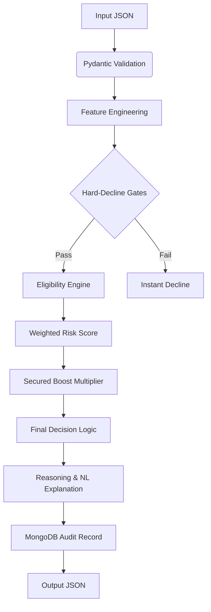

# Risk Scoring Engine — Advanced Loan Origination System (v2)

A **production-grade, explainable risk scoring and loan eligibility engine**. This system ingests credit bureau data, identity signals, IP geolocation, and collateral assets to produce a comprehensive risk assessment.

It calculates a `0–1000` risk score, determines a risk band/decision, and computes the **Maximum Eligible Loan Amount** through two parallel engines.

---

## 🛠️ Project Architecture

```
risc_score/
├── eligibility_engine.py  # NEW: Income-based headroom + Collateral LTV caps
├── config.py              # Central registry: thresholds, weights, policy rules
├── models.py              # Pydantic schemas: 10-feature input, complex output
├── feature_engineering.py # Normalisation (0–1000), EMI math, signal processing
├── rules_engine.py        # Hard-decline policy gates (Policy Overrides)
├── risk_engine.py         # Orchestrator: Weighted Scoring + Fraud Signal aggregation
├── database.py            # MongoDB audit persistence layer
├── utils.py               # Financial formulas, scalers, NL explanation engine
└── main.py                # CLI runner with 10 comprehensive test scenarios
```

---

## 🚀 Quick Start

### 1. Environment Setup
```bash
pip install -r requirements.txt
```

### 2. Run Comprehensive Suite
Executes 10 curated test cases covering prime applicants, defaults, fraud, and secured loans.
```bash
python main.py
```

### 3. Advanced Execution
```bash
python main.py --save-db    # Persist results to MongoDB (localhost:27017)
python main.py --json-only  # Output raw JSON for API integration
```

---

## 🧠 Scoring & Eligibility Architecture

### Pipeline Workflow


### Scoring Logic (10 Features)

| Pillar | Feature | Weight | Purpose |
| :--- | :--- | :--- | :--- |
| **Credit** | CIBIL Score | 23% | Overall creditworthiness history |
| **Capacity**| FOIR | 18% | Existing obligations vs. Income |
| **Behavior**| DPD 90+ | 14% | Serious delinquency history |
| **Discipline**| Credit Utilisation | 9% | Dependence on revolving credit |
| **Intent** | Enquiry Count (6M) | 9% | Credit hunger / desperate borrowing |
| **Stability**| Employment Tenure | 9% | Continuity of income flow |
| **Trust** | Income Verification | 9% | Verification of stated income accuracy |
| **Lifecycle**| Age Band | 4% | Risk proxy (Prime vs. Young vs. Senior) |
| **Fraud** | IP Location Match | 3% | Geolocation vs. KYC address consistency |
| **Asset** | Collateral LTV | 2% | Asset cushion for secured loans |

---

## 🚦 Policy Gates (Hard-Decline)

Any applicant triggering these rules is **instantly declined**, bypassing the scoring model:
- 🎂 **Age**: Under 18 or Over 70
- 🕵️ **Fraud**: VPN/Proxy/TOR detection
- 🗺️ **Location**: IP Country mismatch (International IPs)
- 💳 **Credit**: CIBIL < 650, DPD 90+ ≥ 3, or NPA present
- 💰 **Financial**: FOIR > 65% or Income match < 70%
- 🏠 **Collateral**: LTV breach (e.g., > 75% for Property)

---

## 💸 Loan Eligibility & Counter-Offers

The system generates a **Maximum Eligible Amount** based on:
1. **Income Eligibility**: Affordable EMI headroom based on a target 50% FOIR.
2. **Collateral Eligibility**: Capped by LTV limits (e.g., 90% for FD, 75% for Gold/Property).

> [!TIP]
> **Counter-Offers**: If `requested_amount > final_max_eligible`, the engine overrides the decision to **REDUCE** and suggests a specific counter-offer amount.

---

## 📊 Test Case Summary (V2 Suite)

| # | Scenario | Decision | Key Signal |
| :--- | :--- | :--- | :--- |
| 1 | **Ideal Applicant** | **APPROVE** | Score 850+, Clean record |
| 2 | **Moderate FOIR** | **APPROVE** | FOIR penalty curved, score improved |
| 3 | **High FOIR** | **DECLINE** | Threshold breach (> 65%) |
| 5 | **Fraud Signals** | **REVIEW** | Multi-fraud flag review trigger |
| 6 | **Young Thin File** | **REVIEW** | Age-based soft-override |
| 7 | **Secured Loan** | **APPROVE** | Property collateral (8% boost) |
| 8 | **VPN Detected** | **DECLINE** | Fraud gate activated |
| 9 | **Overseas IP** | **REVIEW** | Country mismatch |
| 10 | **Low Income** | **DECLINE** | Requested amount >> eligible |
| 11 | **No Bureau History** | **REVIEW** | RBI thin-file rules applied |
| 12 | **Settled Accounts** | **REDUCE** | 15% discount applied + downgrade |
| 13 | **KYC Age Mismatch** | **REVIEW** | Vision ID mismatch flag |

---

## ⚙️ Configuration & Tuning

Modify `config.py` to:
- **Rebalance Weights**: Adjust the 10-feature `SCORE_WEIGHTS` dictionary.
- **Tune LTV**: Update `COLLATERAL_LTV_MAP` for different asset classes.
- **Policy Shift**: Change `HARD_DECLINE` thresholds for FOIR or CIBIL.
- **Age Bands**: Refine `AGE_BAND_SCORES` to target specific demographics.
